# Attendance System and User Management

> Codeigniter Web App to Report Employee Attendances
>> Built with Codeigniter 3.* and Angularjs 1.8

## _Usage_
Run this before you start
* `composer install` _Install Packages from Composer_

## _Dependencies_
* `AngularJS 1.8` _Core JS file for project_
* `JQuery 3.^` _Support JS file for project, i use this for datatable support_

## _Plugins_
* `Sweet Alert` _Notification_
* `Selectpicker` _Select Menu Styling_
* `Flatpickr` _Date/Time Select_
* `Dompdf` _Create PDF File for Report/Print_
* `SpreadsheetPHP` _Read & Write Excel Data_

_Etc, i don't remember exactly_

## _Features_
* `Report to PDF/Excel file`
* `Datatables Server-Sides`
* `Auto-Reload Data for Dashboard & Late Notice (not reloading page)`
* `Import SQL File (in-case something urgent needed)`
* `Flatpickr for Input Date/Time Plugin`
* `Selectpicker for Select Menu Styling`
* `Move Date without Reloading Page`

## __Screenshots__
* __Login Page__
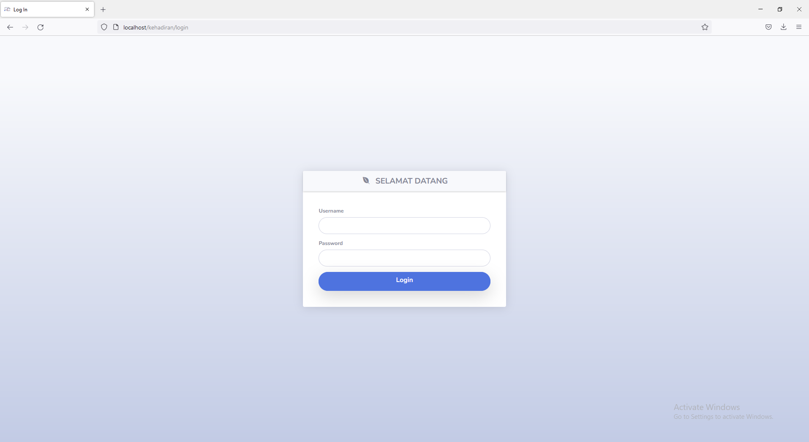
* __Login Page__
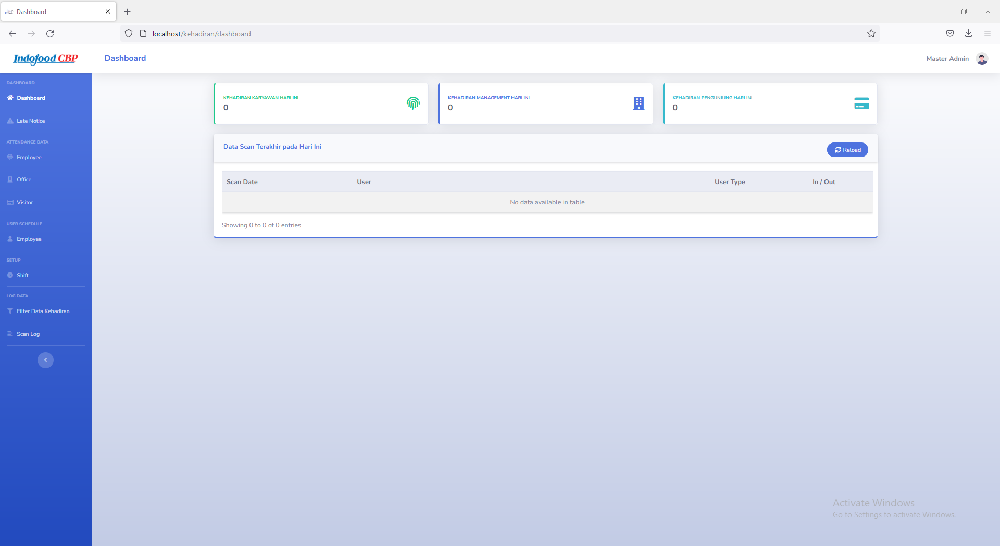
* __Late Notice Page__
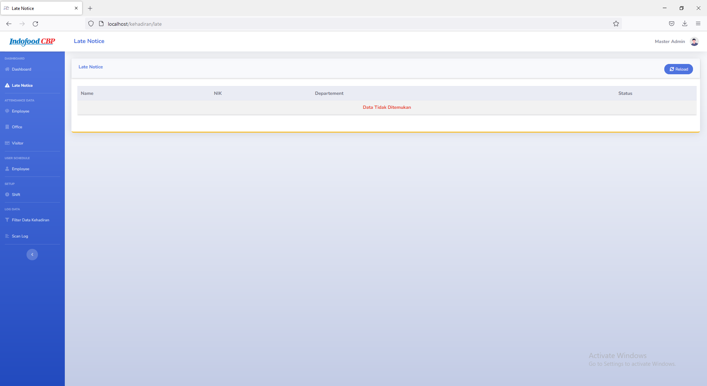
* __Employee Attendance Page (1)__
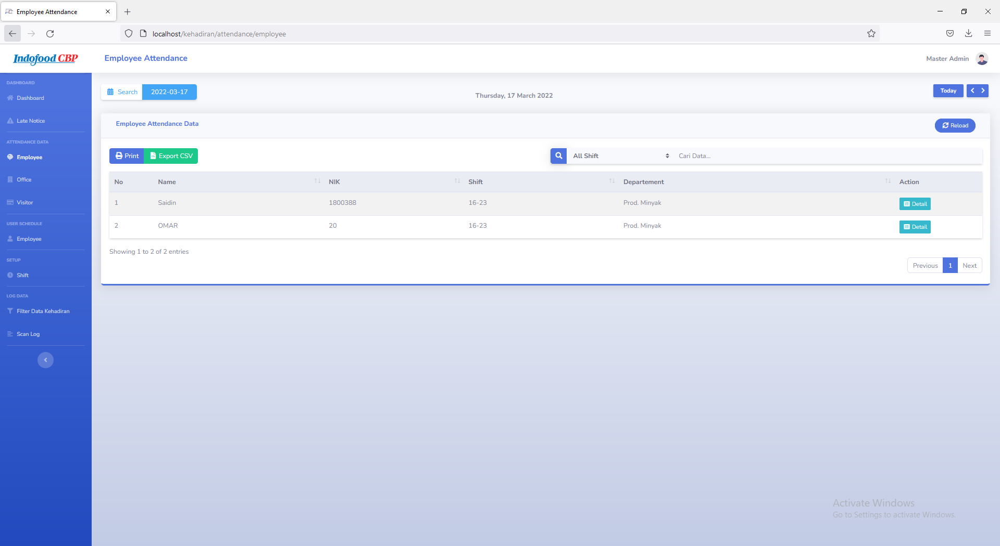
* __Employee Attendance Page (2)__
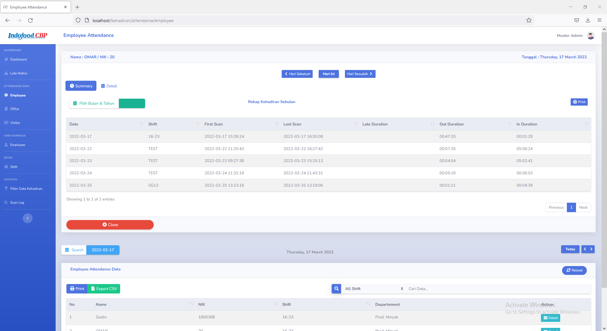

`with monthly report`
* __Employee Attendance Page (3)__
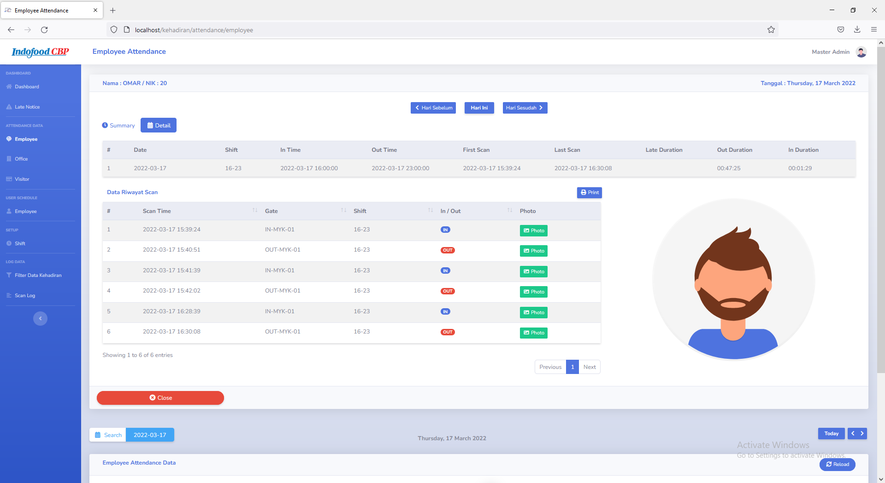

`with daily report`
* __Office Attendance Page__

* __Visitor Report__
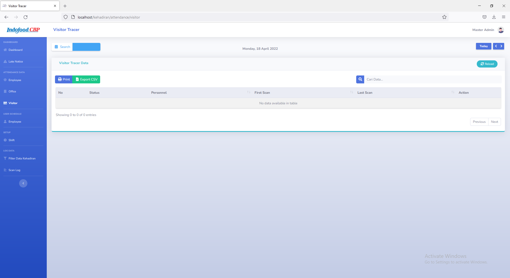
* __Process Schedule__
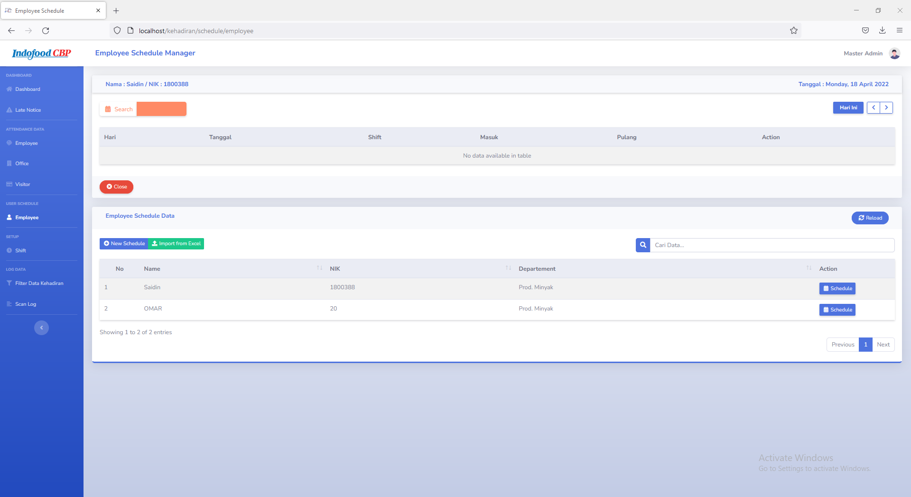
* __Shift Setup__
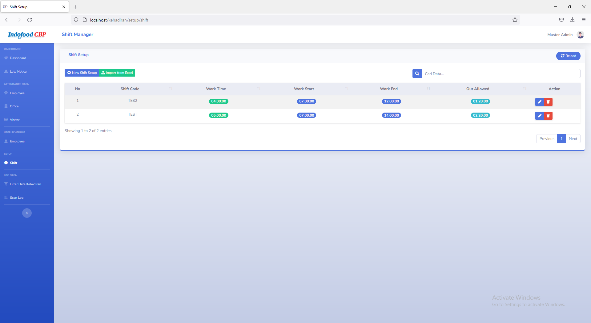
* __Filter Attendance__
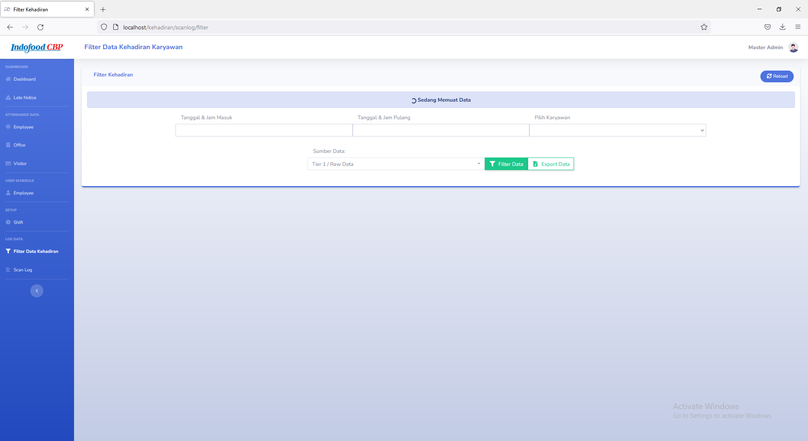
* __Scan Log/Raw Data__
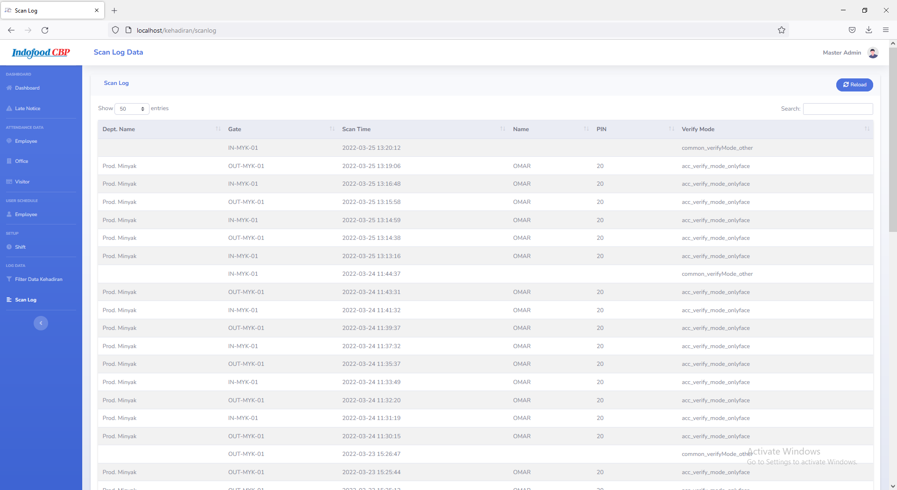